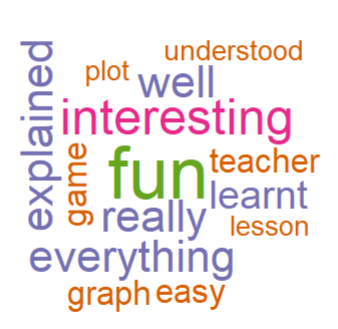

<!-- have to knit first if .Rmd --> 
<style type="text/css">

pred {
  color: red;
  font-weight: bold;
}

pblue {
  color: blue;
  font-weight: bold;
}

</style>

```{r setup, include=FALSE}
knitr::opts_chunk$set(echo = TRUE, message=FALSE, warning = FALSE)

library(wordcloud)
library(RColorBrewer)
library(tm)
library(tidyverse)
```

# What is R-Girls?

The R-Girls School Network, or **R-Girls** for short, is an organization to promote the use of R in secondary schools particularly (but not exclusively) for girls. Their goal is to inspire teachers to incorporate R into their everyday lesson plans. By using R in the classroom, students will be introduced to the amazing world of programming from a young age and in a fun, interactive way. 

For more information about this incredible organization, you can check out the <a href="https://r-girls.github.io/website/" target="_blank">R-Girls website</a>. There you will find many free lesson plans on a range of topics including Math, Science, and Geography. These lessons are created for everyone, regardless of whether you have years of coding experience or you've never heard of R before. If you are new to R there are plenty tutorials and resources available that will help get you started on your R journey. 

# How did I get involved with R-Girls?

Like most opportunities these days, I found out about R-Girls through networking and social media (shout out and thank you to Jenny Richmond!). 

<br>
<center>
{width=70%}
</center>
<br>

I love teaching R, especially to younger students. One of my goals is to share my knowledge and inspire students to want to learn to code. This has translated into many blog articles and video tutorials covering an array of topics in R. I enjoy teaching all students, but am particularly interested in mentoring girls as unfortunately, in today's world, there is still a stigma when it comes to girls and coding. I want to be a role model and show girls that coding can be fun and it's not just for boys. So, when I saw this tweet, I was very excited and couldn't wait to see if and how I could get involved. After getting in touch with the organizers and meeting some of the other members, I quickly realized how passionate everyone was to teach R, so I knew I fit in. 

# How have I contributed to R-Girls?

- Because I have experience building websites in R, I offered to help build the <a href="https://r-girls.github.io/website/" target="_blank">R-Girls website</a>. I built the website in R using the `distill` package. Now, this is still a work in progress, but it's been such a fun and rewarding project. 
- I have also recorded a couple of short <a href="https://r-girls.github.io/website/getting_started.html" target="_blank">tutorials</a> to help teachers, who may have no programming experience, get started.
- I was inspired by the lessons that others in the community already created, so I decided to have a crack at designing my own lesson plan. Understanding the importance of learning about climate change combined with the fact that I lived in Australia for 4 years, I designed a lesson around a data set on the average rainfall in major Australian cities over the past couple of decades. 

# Meeting R-Girls

R-Girls was founded by <a href="https://greenoak.bham.sch.uk/r-girls-school-network/" target="_blank">Green Oak Academy</a> in the UK and I was kindly invited to visit the school and teach my lesson to some of the girls. I was excited to have the opportunity to teach students in years 8, 9, and 10. I couldn't wait to meet everyone and get started! 

## Stroop Task
I come from a cognitive psychology background, so I thought it would be fun to start the lesson off with a demonstration of the <a href="https://www.psytoolkit.org/experiment-library/experiment_stroop.html" target="_blank">Stroop Task</a> The girls spent a few minutes going through this fun, mini experiment where you see colored words (like <pred>RED</pred> and <pblue>GREEN</pblue>) and have to respond to the color of the word not the meaning. We talked about reaction times and how people are often faster at responding to **congruent** words (where the color and the meaning match) compared to **incongruent** words (where the color and meaning do not match). The girls seemed to really enjoy this task/game. In fact, one girl explained she wished they could do *"the game at the start of every lesson".* 

## Rainfall Lesson Plan
Of course, we spent the majority of the time going through the R lesson plan, which can be found <a href="https://r-girls.github.io/website/geography/2022-03-25-rainfalldatapost/" target="_blank">here</a>. 

The lesson objectives include:

- Learning how to read in data to RStudio
- Practicing how to view and explore the data
- Identifying the different variables in the dataset
- Creating a beautiful line graph in R using `ggplot2`
- Interpreting the plot to see how average rainfall has changed over the last 20 years

Here's a quick glimpse of what the data looks like:
<!-- #rainfall <- read_csv("_blog/2022-05-30-jennyrainfall/rainfall_clean.csv") -->

```{r}
rainfall <- read_csv("rainfall_clean.csv")

rainfall
```


Check out the final plot below! Notice that this was created in just a few lines of code.

```{r}
rainfall_plot <- ggplot(rainfall, aes(x = year, y = avg_rainfall, color = city_name)) +
  geom_line()
rainfall_plot
```


# Final Thoughts 

Being part of the R-Girls community has been a wonderful experience - it is a warm, friendly, and incredibly collaborative environment. I have learned so much from the other members and hopefully they can say the same for me. This is a worldwide community project, so if you wish to contribute please get in touch via <a href="https://r-girls.slack.com/" target="_blank">Slack</a>, <a href="https://twitter.com/R_Girls_School" target="_blank">Twitter</a> or [email](mailto:rgirlsschool@gmail.com).

I'm so proud to be part of the R-Girls community and grateful for the opportunity to go and visit the R-Girls School in person! I had such a blast meeting and teaching the girls. The girls were very engaged in the lesson and we got a lot of positive feedback. I'll end by sharing a wordcloud of the students' feedback that I created using the R `wordcloud` and `RColorBrewer` packages (I also followed along to <a href="https://www.youtube.com/watch?v=oVVvG035vQc" target="_blank">this short tutorial</a>) `r emo::ji("smile")`

<center>
{width=50%}
</center>

```{r include=FALSE}
feedback <- read_csv("rgirls_feedback.csv")
#feedback <- read_csv("_blog/2022-05-30-jennyrainfall/rgirls_feedback.csv")
corpus <- Corpus(VectorSource(feedback$feedback))

# corpus[[1]][[1]]
# corpus[[2]][[1]]

corpus <- tm_map(corpus, content_transformer(tolower))
corpus <- tm_map(corpus, removeNumbers) 
corpus <- tm_map(corpus, removeWords, stopwords("english")) # remove english common stopwords "a", "the", etc.
corpus <- tm_map(corpus, removePunctuation) 
corpus <- tm_map(corpus, stripWhitespace) 
corpus <- tm_map(corpus, removeWords, c("went", "something"))
#corpus <- tm_map(corpus, stemDocument)

# create TDM
tdm <- TermDocumentMatrix(corpus)
m <- as.matrix(tdm)
v <- sort(rowSums(m), decreasing=TRUE)
d <- data.frame(word = names(v), freq=v) %>%
  filter(freq > 1)

set.seed(21)
wordcloud(d$word, d$freq, random.order = FALSE, scale=c(3,.5), rot.per = .3, colors = brewer.pal(5, "Dark2")) # 5, "Dark2")
```


