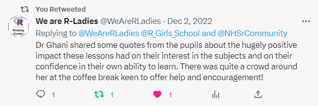
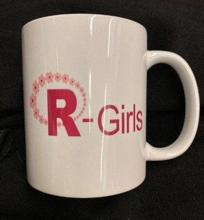

<!-- have to knit first if .Rmd --> 
<style type="text/css">

pred {
  color: red;
  font-weight: bold;
}

pblue {
  color: blue;
  font-weight: bold;
}

</style>


```{r setup, include=FALSE}
knitr::opts_chunk$set(echo = FALSE)
```

In 2022, <a href="https://nhsrcommunity.com/" target="_blank">NHS-R Community</a> founder <a href="https://www.bradford.ac.uk/staff/mamohammed5/" target="_blank">Professor Mohammed A Mohammed</a> (University of Bradford and the <a href="https://www.strategyunitwm.nhs.uk/" target="_blank">Strategy Unit</a>) came up with the idea of introducing the joy of R to an audience far beyond the usual reach of data science: girls at secondary school. The goal was not to teach R as a programming language – because the term ‘computer science’ is often met with class-wide groans – but instead to use R to support the teaching and learning of maths, science, geography and other subjects across the curriculum. If successful, this would provide an entry point for data science using R – a much needed enabler to include women in data science.

So after much planning and testing, (and more planning and testing), this intrepid innovation was introduced to the classroom, and the results?

Well, as one student said, I never knew data could be this fun!

<br>
<center>
{width=50%}
</center>

# Budding Potential: Empowering Girls in Data Science

We designed R-Girls to be set up as a worldwide network to promote the use of R – a data science programming language – in secondary schools for girls. The lack of women in science and engineering (STEM, including data science) fields is an ongoing issue, and at R-Girls, it is our hope that we can help to change that, particularly for girls of lower socio-economic and ethnically diverse backgrounds. 

Inspired by the success of a similar undertaking, the NHS-R Community, Mohammed joined forces with <a href="https://greenoak.bham.sch.uk/" target="_blank">Greek Oak Academy’s</a> headteacher Dr Razia Ghani, who has a background in statistical programming, to lay the groundwork for a new wave of learning that would allow its students to learn a modern, dare we even say, ‘cool’ skill that they could carry with them for life. This early introduction and exposure to data science would allow them to explore it as a potential career option. After all, in this data-driven world, there’s always room for one more data scientist.

# Planting the Seeds: Key Decision Factors

One of the key motivators for Mohammed was to ‘impart the joy of learning R’ – spoken like a true educationalist! As professionals, he and Dr Ghani knew introducing R at a secondary educational stage held immense uncertainty along with immense value. Allowing the girls to get to grips with the coding world in a safe and familiar environment could only set them up for future success. And with R being open-source and free, it made it the perfect choice of educational software: easily accessible, with numerous resources, allowing the girls to access it not just within school premises, but at home and beyond, too. 

However. Getting secondary school girls to understand why they now had another lesson on their already packed timetable was a different story entirely.

Which is why, in order to make this transition as easy and low-key as possible, we chose to include R within existing STEM subject lessons – ie. maths, science and geography – rather than introducing it as a separate lesson. In doing this, our hope was to ease the resistance to learning something as dry-sounding as ‘computer science’. Instead, the girls were taught how R could help them with their current work especially where this involved collecting and analysing data and producing graphs in a fun way. This decision also prompted us to use R Markdown from the outset as we wanted the girls to understand how data and report writing went hand in hand.

# Navigating the Terrain: Challenges and Hurdles

As with every undertaking, there are hurdles to work through, and the first hurdle was funding.

With bated breath, Mohammed and Dr Ghani submitted a funding bid to the R Consortium and were delighted to receive seed funding to start the project at Green Oak Academy, a small, independent inner-city school in Birmingham UK.

Mohammed knew from his time using R that while it was possible to download R onto each computer individually, installation was…challenging. The thought of trying to talk a classful of secondary students through installing software, navigating privileges, grappling with operating systems and keeping on top of update packages would shake even the staunchest of tech pros. So we knew we had to use a cloud based solution... and <a href="https://posit.cloud/" target="_blank">Posit Cloud</a> (formerly RStudio Cloud) came to the rescue.

So we had secured some funds, we had cloud access to R, but now for the final hurdle: none of the teachers knew what R was.

And, as teachers are overworked and time-poor, it was imperative that we had to make this new learning opportunity as easy as possible for them. Which is why, over the course of 6 weeks – an entire summer holiday, in fact – we designed 10 oven-ready lessons for teachers to use.

Developed with the aid of STEM subject teachers, these lessons mapped out fundamental concepts, such as how to draw a straight line graph, and data interpretation from science experiments. 

These lessons were then pilot tested with a few teachers in a two hour training session. The teachers’ feedback was taken on board and key refinements were made. This cycle of feedback and revision resulted in speedy, refined improvements that allowed R Girls to move onto the next stage relatively quickly: pilot trials.

# Budding Potential: Pilot Trials

With our teachers trained up and the tech in place, it was time to begin the live trials.

Holding our breath, we started with two introductory lessons to allow the girls to acclimatise to R-markdown and R, and then moved them onto more structured tasks.

Our teachers were also brought into these pilot lessons as classroom assistants to allow them to adjust to the flow of the lesson, observe the situation and gain an understanding of how things would work without putting them under the pressure of having to lead. (Trying to attend to seven different calls of ‘Miss, I’ve forgotten my password!’ while delivering a coding lesson is no easy feat!)

In order to have a similar feedback cycle, after each lesson, we asked the girls to reflect on the lesson and write down what went well and what could be improved, fully expecting a list of complaints and objections. Instead, we received this.

<br>
<center>
{width=50%}

</center>

# Lessons in Full Bloom: Reception to R in the Classroom

Reassured by the unexpected but very welcome enthusiasm from the girls, we began to roll out the lessons in full force to the whole school, and the results have been equally overwhelmingly positive.
The girls learnt how to produce graphs, do calculations and write reports. We regularly share their feedback on our Twitter channel <a href="https://twitter.com/r_girls_school?lang=en" target="_blank">@R_Girls_School</a>, typos included. `r emo::ji("wink")`

The teachers have become increasingly interested, too. We now have three teachers who are confident enough to deliver R lessons, and our science teacher has taken the initiative to plan a series on building your own website in R which we’re excited to share this summer. We even have the English teachers wanting in on it!

We have also now come to the point where these R lessons are now officially timetabled into the school’s curriculum, which is a huge step towards putting R into the curriculum.

# Branching Out: The Ripple Effects

In the 24 months since R Girls began, we’ve made more progress than we’ve ever dreamed.

In 2022, our headteacher Dr Ghani gave two talks at high profile conferences, <a href="https://www.ascent.io/earl" target="_blank">EARL2022</a> and <a href="https://nhsrcommunity.com/events/nhs-r-community-conference-2022/" target="_blank">NHS-R2022</a>. The feedback from the audience was overwhelmingly positive, with many people saying the talks were inspirational.

According to fellow network <a href="https://rladies.org/" target="_blank">R Ladies</a>, there was quite a crowd around Dr Ghani at the coffee table after, keen to offer ideas and help!

<br>
<center>
{width=80%}

</center>

We’ve had some wonderful guest speakers come to Green Oak Academy to deliver R lessons, women who are involved in R themselves. These include <a href="https://batool-almarzouq.netlify.app/" target="_blank">Dr Batool Almarzouq</a> who came all the way from Saudi Arabia to deliver a lesson on <a href="https://rgirls.org.uk/geography/2022-02-26-drawingmapspost/" target="_blank">mapping</a>. Dr <a href="https://jennysloane.netlify.app/" target="_blank">Jenny Sloane</a> from Australia became a key contributor, delivering a video series on how to create a website in R, while also creating R Girls’ very own <a href="https://rgirls.org.uk/" target="_blank">website</a>, and also came to deliver a lesson on <a href="https://rgirls.org.uk/geography/2022-03-25-rainfalldatapost/" target="_blank">plotting rainfall data</a> from Australian cities.

And from the NHS <a href="https://www.strategyunitwm.nhs.uk/" target="_blank">Strategy Unit</a>, <a href="https://www.strategyunitwm.nhs.uk/author/justine-wiltshire" target="_blank">Analytics Manager Justine Wiltshire</a> was inspired by our presentation at NHS-R and went to her local primary school’s STEM day to talk about data science! When we then invited her to come and cheer on our girls as they made their websites, she was thrilled and we are looking forward to her visit.


<br>
<center>
{width=80%}

</center>

And as if that wasn’t enough, we were voted as Charity of the Year at the industry R conference (EARL 2022) - a great honour. 

# Growing Together: Future Plans and Funding

From a tiny seed of an idea, R-Girls has unfurled into something bigger than we could have ever imagined. We’ve spoken at major conferences, connected with incredibly talented and influential women, and begun to instil the love of R into a new generation of young women with flourishing results. 

But R-Girls has not been an isolated effort. Everything we’ve achieved so far has been through the help of so many supporters, from the teaching staff at Green Oak Academy, to key funders such as <a href="https://www.r-consortium.org/" target="_blank">RConsortium</a>, <a href="https://www.ascent.io/" target="_blank">Ascent.io</a>, <a href="https://posit.co/" target="_blank">Posit</a> and kind volunteers and supporters from R-Ladies who want to remain anonymous who have simply seen our endeavour as worthwhile and have wanted to help.

While we now have a library of <a href="https://rgirls.org.uk/index.html" target="_blank">ten, ready to go lessons for all to use</a> (no prior R knowledge required!), we’ve only begun to scratch the surface of what R can do. It is our goal to create a comprehensive library of these lessons, making the introduction of R into other secondary schools as easy as 1,2,3.

But in order to achieve this we need support. We need continued access to Posit Cloud, a cornerstone of our project. And that’s not all. Our modest IT suite is in desperate need of an upgrade and we’ve now reached the point where we need additional staff to manage R-Girls, and make more lessons! 

We’d also love to be able to introduce the girls to more role models by inviting other guest visitors. Most of all, we need help to reach out to girl’s schools all over the world.

These are just some of the ways you can help. We are always looking for donations or you could order a R-Girls mug.  Just drop an email to [rgirlsschool@gmail.com](mailto::rgirlsschool@gmail.com).


<br>
<center>
{width=25%}

</center>

All of us at R-Girls are looking forward to stretching out our branches even further. We still have plenty of ground to cover to reach our goal of including secondary school girls within the vast and ever-growing world of data science, but we can’t wait to see what we can achieve in 2023+! 
