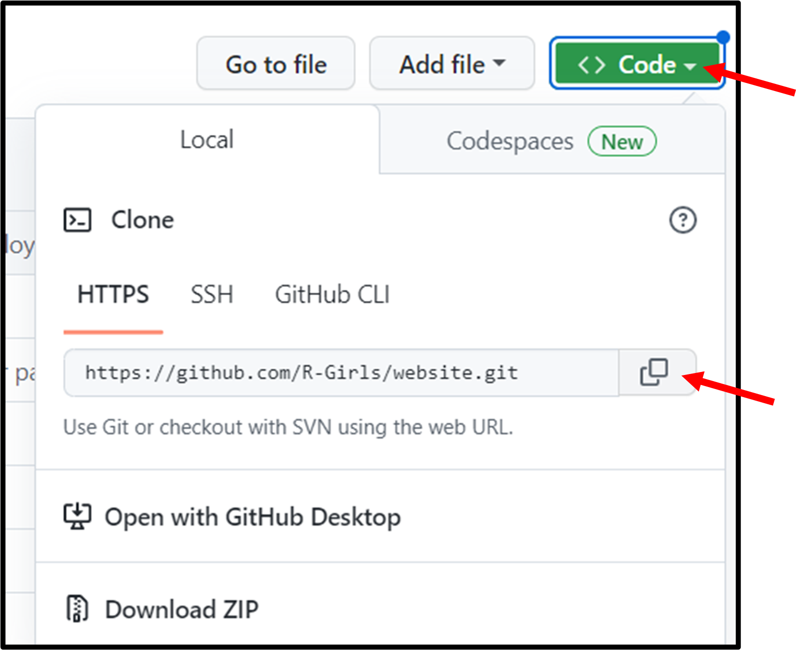
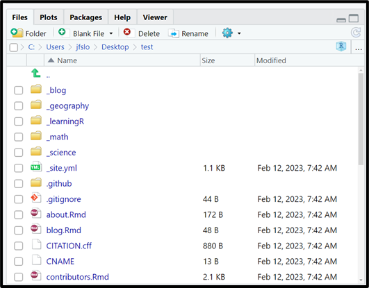

```{r setup, include=FALSE}
knitr::opts_chunk$set(echo = TRUE)
library(distill)
```

*Please note: you'll need to have Git installed on your computer and the distill package installed first*

# Step 1: Create your lesson plan

The very first step is to put together your RGirls lesson plan! To do this, we recommend using the RGirls lesson plan template. To do this, please follow along with the steps below.

- Install and load in the RGirls package 

```{r eval=FALSE}
devtools::install_github("R-Girls/RGirls")
library(RGirls)
```

- Go to the [RGirls GitHub Repository](https://github.com/R-Girls/RGirls) and follow along with the steps under "Lesson plan template"

*If you just installed the RGirls package and can't find the rgirlspdf, try restarting R or even closing and reopening RStudio*

- Modify the file as needed to incorporate your new lesson plan

- Knit the file to make sure everything looks good 

- At this point, I recommend saving your lesson plan somewhere safe on your computer and we will come back to it later 

# Step 2: Clone GitHub repository

**You will only need to do this step one time. Once you follow these steps and set up your R Project, you can add and modify as many lessons as you'd like.**

In order to add your lesson plan to the website, the next thing you need to do is clone the **RGirls Website** Repository (please note this is a different repository than the one we used to create our lesson plan) to your local computer. We will do this by setting up a version control R project through Git. This will allow you to work in RStudio on your computer and push updates to GitHub, which will in turn update the website. 

- Navigate to the [RGirls Website GitHub Repository](https://github.com/R-Girls/website)

- Click the green code button and copy the URL

{width=40%}
<br>

- Open RStudio and in the top right corner, click on the “Project” button and select New Project

{width=40%}
<br>

- Then click Version Control -> Git -> and paste the URL that you copied from GitHub. a.	Make sure to click on browse to save your project to a safe location on your computer.

# Step 3: Understanding the file structure

Now you should have your own clone of the RGirls Website repository. In other words, you have a new R Project that contains all of the files to create the RGirls website. Because this project was created through Git, you can make updates and changes in order to update the website. Before moving on to adding your new lesson plan to the website, let's take a few minutes to understand the file structure of this project. Your files tab should look similar to this (although files and folders may be updated)

{width=40%}
<br>

The folders at the top with the underscore are the different "posts" that have already been created. A post is a distill term, which is essentially a unique category of blogs or lessons that you want to share. For example, on the RGirls website we have a "Blog" tab with RGirls blogs. You can find these blogs in the `_blog` folder. There are also folders for the different categories of lessons (e.g., math, science, geography, etc.). 

Just as a heads up: when you create a new post in distill, you have to specify which "collection" (aka which folder) you want to add your lesson to. For example, if you are creating a new Math lesson, you'll want to add it to the `_math` folder. Once you add your lesson, it will be updated on the website and your new post will be at the top of the page. 

{width=40%}
<br>

There are a lot of other folders and a few other folders in our project, but for the purposes of creating a new lesson, we will not worry about everything else. You are welcome to explore the different folders and files, but please do not make any changes to the other files as we do not want to accidentally break anything on the website. 

# Create New Lesson Post

Okay, now we are ready to create a new post so we can add our lesson plan to the RGirls website.

**I recommend following along with my [YouTube Tutorial](https://www.youtube.com/watch?v=b7TLIX6z1JQ) starting at 10:03**

- First, make sure to have the distill package installed and loaded in

```{r eval=FALSE}
# install.packages("distill")
library(distill)
```

## `create_post()` 

- In the console, use the `create_post()` function (this is a Distill function) to create your new lesson 

  - The first argument you need to specify is the title. I recommend adding "_post" to your title as a way to remember this is the lesson post which is different from your .Rmd file that you created from the RGirls template.  

  - The second argument you need to specify is the collection. This will save your lesson to the correction location. Currently, the possible collections are (even though the folders in our directory are written with an underscore, do not use an underscore here):
    - "math"
    - "science"
    - "geography"
  
  - Press enter to run this code in your console

**For purposes of this guide, I'll pretend to create a math lesson called "test"**

```{r eval=FALSE}
create_post(title = "test_post", collection = "math")
```

**If you wish to add a new category (aka collection), you can follow along with my [YouTube Tutorial](https://www.youtube.com/watch?v=b7TLIX6z1JQ) starting at 7:10.**

- You'll see an .Rmd file (`testpost.Rmd`) will automatically pop up. This is the .Rmd file of your new lesson for the website! Don't worry about editing the content just yet, we'll come back to this .Rmd file in a minute.

- You can also navigate to the folder of the category of your lesson (e.g., _math if you are creating a math lesson) and there will be a new folder with today's date and the title of your lesson. Click on the folder and you will see where the .Rmd file is saved. 

## Upload your .Rmd lesson plan

Now that we have our folder created for our new lesson, let's add our .Rmd lesson plan that we created in Step 1. I find it easiest to do this outside of RStudio.

- Outside of RStudio, navigate to where you have saved this R Project

- Open the folder that you just created for your new lesson (e.g., my test folder would be called "YYYY-MM-DD-testpost")

- Make a copy of your beautiful lesson plan and save it in your new post folder. I recommend saving it with a similar name as the other .Rmd file in this folder excluding "post". So for me, I had `testpost.Rmd` and now I'll save my actual lesson as `test.Rmd`. I know this is a little confusing, but to try to clarify:

  - The `test.Rmd` is your "clean" lesson that follows the lesson template. This will also be the .Rmd file that people can download directly from the website. 
  - The `testpost.Rmd` is similar because it will eventually have the code to the lesson too, but it will also have extra code that is necessary for the lesson plan to integrate with the website and display properly online. 
  
- This is a good time to upload any other necessary files for your lesson post. For example, some of the previous lessons have word docs and pdfs available for download directly from the website. As an example, see the screenshot below of the Boxplot lesson plan - note that this lesson plan has an .Rmd, a word doc, and a pdf that you can download straight from the website. In order to download these files, they need to be saved in your lesson folder. So, if you wish to add any files like this, make sure to upload them to this folder now. 

{width=40%}

<br>

## Update your lesson post

Now that you have your beautiful lesson plan created and saved in the correct location, we can update the `testpost.Rmd` file. I recommend opening another existing post to see how it's formatted. For example, go to `_math` -> `2022-03-11-boxplotpost` -> and open `boxplotpost.Rmd`. Please don't modify this code, but it will be useful to reference as you go through the next several steps. 

- To start, open up the `testpost.Rmd` file

- Edit the code in the YAML (which is the code in between the --- at the top of the .Rmd file)

  - Do not delete this code
  - Rather, modify it with the correct content. For example, add the title of your lesson plan and a brief description that you'll want to show up on the website. 
  - You can always comment out a line of code in the YAML if you do not want to include it. For example `#author: []` if you don't want to include an author. 

- Directly under the YAML add the following lines of code which will create the links on the website for people to download a copy of your lesson plan (this code should **not** be placed inside an R chunk):

  - Modify this code to make sure the `here("_math", "YYYY-MM-DD-testpost", "test.Rmd"), text = "Download .Rmd here")` function has all of the correct information:

    - The first argument should be the correct collection (e.g., _math, _science, _geography)
    - The second argument should be the name of the folder that was created when you ran `create_post()` (e.g., "2022-03-11-boxplotpost")
    - The third argument should be the actual file you want to download. Make sure to have the files saved in this folder

```{r eval=FALSE}
<div class="contributor_org">
`r xfun::embed_file(here::here("_math", "YYYY-MM-DD-testpost", "test.Rmd"), text = "Download .Rmd here")`

`r xfun::embed_file(here::here("_math", "YYYY-MM-DD-testpost", "test.docx"), text = "Download word document here")`

`r xfun::embed_file(here::here("_math", "YYYY-MM-DD-testpost", "test.pdf"), text = "Download pdf here")`
</div>
```

- Let's say you only have the .Rmd file that you want to make available to download. No problem! Only include the code:

```{r eval=FALSE}
<div class="contributor_org">
`r xfun::embed_file(here::here("_math", "YYYY-MM-DD-testpost", "test.Rmd"), text = "Download .Rmd here")`
</div>
```

- The rest of the `testpost.Rmd` file will contain your lesson plan. So, go to `test.Rmd` and copy all the code excluding the YAML and paste it under the `</div>` tag

- Finally, after the ##THE END of your lesson add the following code for information about the license and citation (again, do **not** put this in an R chunk)


```{r eval=FALSE}
<div class="license">
**License and Citation:** You can use, modify, and adapt any of the lessons, but please include the following attribution: *RGirls Community. (2022, April 10). RGirls Lessons. Zenodo. [https://doi.org/10.5281/zenodo.6436861](https://doi.org/10.5281/zenodo.6436861)* 
</div>
```

# See if everything worked

- Once you're happy with the content of your lesson plan, make sure to knit the file (the `testpost.Rmd` file). As soon as you knit your file, it will create a .html file of your lesson, which is necessary in order to add it to the website. 

- It's a good sing if you were able to knit your file with no errors, but now let's try to build our website. 

- In the top right hand corner, go to the Build tab and click Build Website

- If the website pops up in the Viewer pane of RStudio click on the "show in new window" button directly next to the broom 

- Go to the Math Lessons tab (or whichever category your new lesson falls under) and make sure your lesson is there. It should be at the top because it's ordered by date. 

- Click on your lesson plan and make sure everything looks good. Things to check for:

  - Make sure the description is there
  - Make sure you can successfully download the files (if you included any to download)
  - Make sure the lesson plan is all there
  - Make sure the license and citation text is there

*If you don't see your lesson plan, go back to your `testpost.Rmd` and knit the file. And then try to build your site again and see if it works*

# Push Changes to GitHub

**You can follow along with my [YouTube Tutorial](https://www.youtube.com/watch?v=b7TLIX6z1JQ) starting at 20:05.**

**If this is your first time connecting to GitHub from RStudio, you can following along with [this YouTube Tutorial](https://www.youtube.com/watch?v=NLU05CopNzU) starting at 15:40.**

Now that we confirmed that the new lesson is working on our local computer, we need to push all the changes to GitHub so the actual website will be updated. 

To do this we need to do three things: Stage, Commit, and Push. 

1. Stage: at the top bar, go to Tools -> Shell and type "git add -A" in the command line and push enter. This will stage all the changes, which means that we want to select ALL of the changes we made. You can close out of the shell now. 

2. Commit: back in the Git tab, click on Commit

- You'll see that all the boxes are now checked (because we staged everything)
- You need to leave yourself a message under "commit message". For example, your message could be "added new boxplot lesson to math lessons". This is important for version control, so you know what changes you've made with each update. 

3. Push: finally, click the green push button. 


